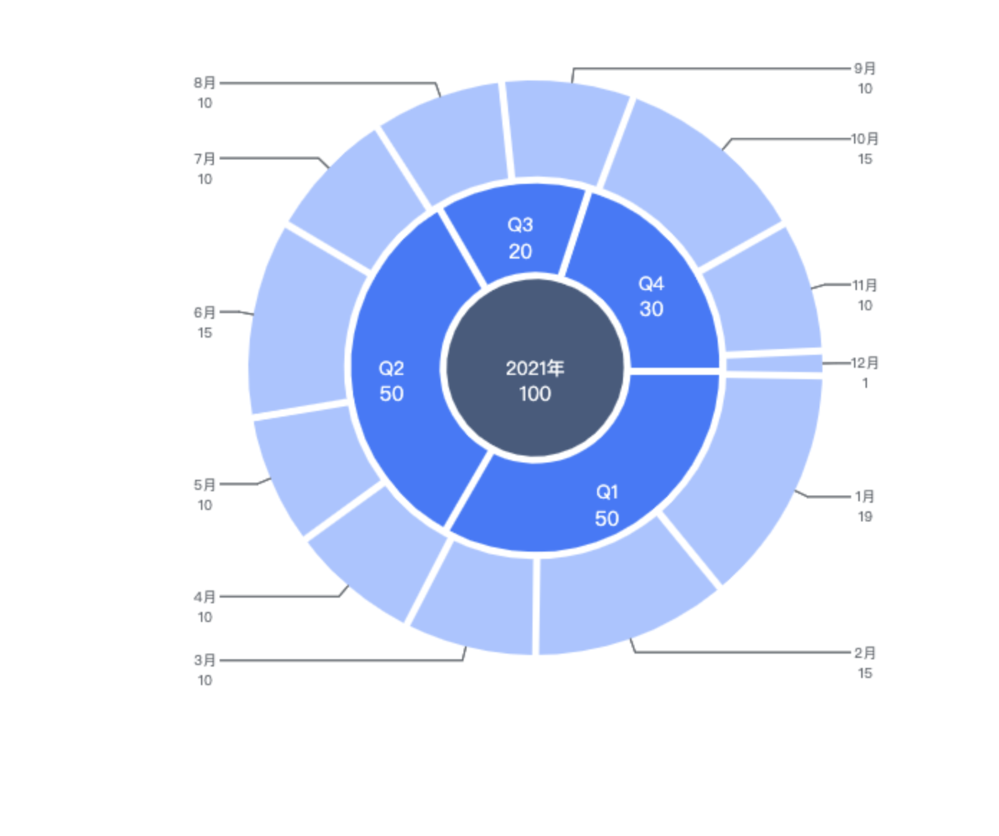

# sunburst-chart
为了满足产品需求而手写（撕）的一个项目，务必暂时按照 demo 的配置使用

demo 在线地址：https://dwqdaiwenqi.github.io/simple-sunburst-chart/demo/   

效果：

### 运行方式
1、安装依赖
```bash
npm i sunburst-chart@latest
```

2、本地体验
```bash
http-server ./ -p 8888
```
本地地址：http://localhost:8888/demo

### 使用
```html
<script type="module">
  import Sunburst from '../src/index.js'

  let data = [
    [{name:'2021年',value:100,meta:{name:'2012'}}],
    [{name:'Q1',value:50,meta:{name:'q1'}},{name:'Q2',value:50,meta:{name:'q2'}},{name:'Q3',value:20,meta:{name:'q3'}},{name:'Q4',value:30,meta:{name:'q4'}}],
    [
      {name:'1月',value:19,meta:{name:'01'}},{name:'2月',value:15,meta:{name:'02'}},{name:'3月',value:10,meta:{name:'03'}},{name:'4月',value:10,meta:{name:'04'}},
      {name:'5月',value:10,meta:{name:'05'}},{name:'6月',value:15,meta:{name:'06'}},{name:'7月',value:10,meta:{name:'07'}},{name:'8月',value:10,meta:{name:'08'}},
      {name:'9月',value:10,meta:{name:'09'}},{name:'10月',value:15,meta:{name:'10'}},{name:'11月',value:10,meta:{name:'11'}},{name:'12月',value:1,meta:{name:'12'}}
    ],
  ]
  let chart = Sunburst({
    data: [...data],
    $el: document.querySelector('#place'),
    gap: 10,
    levels: [
      { color: '#536686' },
      { color: '#5284f5' },
      { color: '#b5cbfd' },
    ],
  });

  chart.autoResize();

  chart.onElementClick((params) => {
    console.log(params.meta)
  });

</script>

```