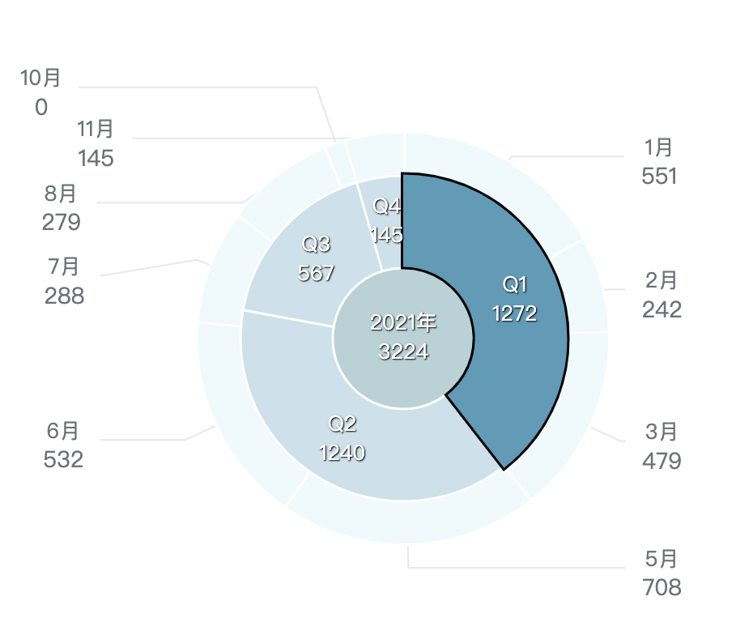
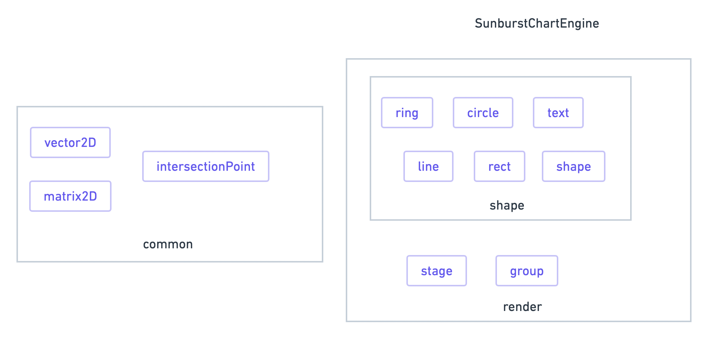

# 可视化之旭日图的实现

## 写前面
图表在前端开发中是见怪不怪了，常用的图标有：柱状图、饼图、折线图、面积图、雷达图，等等...其中大部分的图表我们业界常用的图表库（echarts、g2）通过一些配置项都能满足需求。但总有一些比较冷门的图表，再加上一些神奇的自定义交互与视觉，通过配置项已经无法实现了，如下:



痛点如下：
* 最内层是个圆 （旭日图最内层不存在圆）
* 每层圆环们内/外半径不一致
* 最外层 label 并不在圆环上，而是一种常见的饼图 label 布局样式

~~所以这个需求做不了~~
所以需要自己绘制出这个旭日图。

## 渲染引擎
经过衡量，决定实现一个为以上旭日图量身定制的渲染引擎。主要有以下几点思考：
* 此图表并没有特别复杂的交互与视觉
* 为绘制图表而生的渲染引擎业界很少，文档不友好
* 如使用前端游戏开发的渲染引擎，体积太大，实属大炮轰蚊子

这个渲染引擎只需要能够实现这个图的最小功能即可，有以下这些特性：
* 对象的交互事件: 支持 `mouseover`、`mouseout`、`click`
* 基本的元素绘制: 支持 `text`、`line`、`ring`、 `circle`、`rect`
* 坐标变换的抽象: 使用姿势为 `obj.scale = 2`， `obj.x = 11`，`obj.rotate = 10`..
* 方便的管理元素：任何对象都会继承 `group`，使用姿势为`stage.add(element)`， `element.add(element)` 

### 引擎架构



**整个引擎非常的小，没有相关冗余代码，轻量、纯粹**

基本使用如下：
```js
import {Stage,Ring} from './render/index'
const stage  = Stage($el.offsetWidth,$el.offsetHeight,$el)
const ring = ({
	innerRadius:10,
	outerRadius:20,
	startRadian:.2,
	endRadian:1.5
})
stage.add(ring)
stage.tick(()=>{
	stage.update()
	// …
})
```
以上代码就绘制了一个坐标在(0,0)上，颜色为黑色的圆环

外层圆环部分的实现：
一个外层圆环部分是由一个圆环(ring)，文字(text)，两条折线(line)构成的。
一个ring含有下面几个重要的属性：

四个顶点的计算分别是：
p0 = 
中心点：
中心点计算可以由
法向量：
切线向量：

旭日图的构成：
旭日图是由圆环(ring)、文字(text)、折线(line) 构成的，只需要实现最外层一个 ring 组合的绘制，后面整个旭日图可以通过合适的配置来生成。


1.什么是渲染引擎

绘制前，得先选用一个渲染引擎，常见前端渲染引擎 pixijs、cax、threejs、
base（group、shape） -> （stage、line、text、ring、circle）
common （vector，interaction with line，collision，debounce）
navite api canvas2d


4.旭日图的构成
旭日图是由3组圆环和折线和文字构成，整个旭日图的构成，就是由一个个 ring 组成的，只需要知道其中的最外层 ring 和折线的绘制原理，其他通过计算参数进行拼装即可。


5. 外层Ring 绘制
 
一个 ring 
```js

```

Ring 折线 1、Ring 折线 2

```js

```

再加上字。好了，一个最基本的 Ring 已经完成了。


问题1: 外圈 label 的重叠

如果是两组数据的占整体数据量的数量差不多，并且紧紧爱着，那么他们的 labe 就会重合了。

解决方案：
1）两个圆的碰撞
```js

```
2）推开一段距离
```js
```

问题2：折线的连接，计算交点


问题3：模糊
dpr * width


总结：综上，我们介绍了一个基本渲染引擎的构成，并且着重说明了 Ring 的实现和label 的布局算法。通常图表库都会有自己的一套底层渲染引擎，用来支持更上层的开发，希望这篇文章可以给大家对前端可视化领域有进一步的了解。
